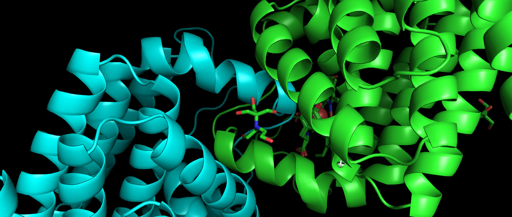
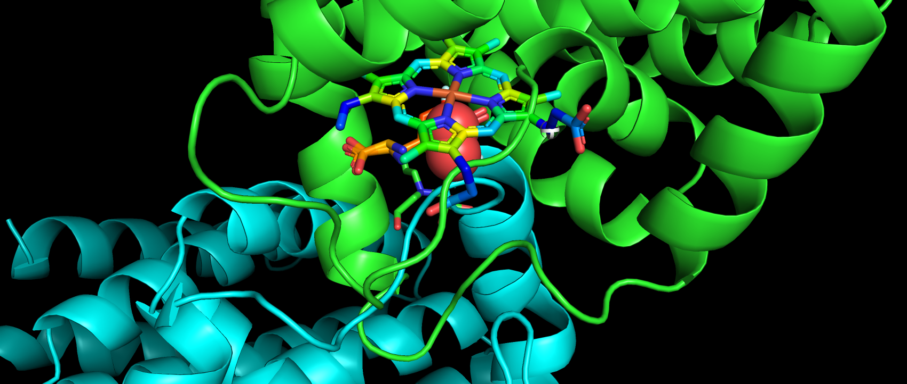

# Diseño de nuevas enzimas mediante scaffolding del centro activo de enzimas de estructura conocida
El objetivo principal de este trabajo es, utilizando el modelo [RF*diffusion*](https://github.com/RosettaCommons/RFdiffusion), diseñar nuevas enzimas a partir de estructuras ya conocidas.
Para ello, hemos seguido el siguiente procedimiento:
- [Generar el backbone de la nueva enzima](#generar-el-backbone-de-la-nueva-enzima):
  - [Definir el motivo a partir del sustrato](#definir-el-motivo-a-partir-del-sustrato).
  - [Aplicar *motif-scaffolding* al motivo para generar la estructura de la proteína](#aplicar-motif-scaffolding-al-motivo-para-generar-la-estructura-de-la-proteína).
  - [Aplicar *inverse folding* para obtener la secuencia de aminoácidos](#aplicar-inverse-folding-para-obtener-la-secuencia-de-aminoácidos).
- [Medir la calidad de las enzimas generadas](#medir-la-calidad-de-las-enzimas-generadas):
  - [Generar usando *AlphaFold* la estructura de la proteína](#generar-usando-alphafold-la-estructura-de-la-proteína).
  - [Analizar la calidad del *bolsillo* generado en torno al sustrato](#analizar-la-calidad-del-bolsillo-generado-en-torno-al-sustrato).
    
En primera instancia definimos y aplicamos el flujo de trabajo al monómero [6VDZ](https://www.rcsb.org/structure/6vdz), para después tratar de extender el procedimiento al díımero [7KQU](https://www.rcsb.org/structure/7kqu). En ambos casos se trata de oxidoreductasas con sustrato un grupo HEMO:
- [Resultados 6VDZ](#resultados-6vdz)
- [Resultados 7KQU](#resultados-7kqu)

## Generar el backbone de la nueva enzima.
Para realizar el trabajo hemos utilizado el modelo de difusión descrito en [RF*diffusion*](https://github.com/RosettaCommons/RFdiffusion), por lo que  que hemos construido un entorno local tal como se describe en el GitHub.
Sobre este entorno hemos añadido el código ```mytools/utils.py``` y hemos modificado ```rfdiffusion/inference/utils.py```.

### Definir el motivo a partir del sustrato.

Para definir el motivo en torno al que queremos generar la nueva proteína, consideraremos los residuos cuya distancia al sustrato sea inferior a una longitud propuesta. Definimos la distancia entre residuo y sustrato como la mínima distancia de los átomos del residuo (capturados en el PDB) y los átomos del sustrato.

Para ello usamos el código:
```python
from rfdiffusion.inference import utils as iu
from mytools import utils as myu

# Seleccionar motivo
# dist < 5A
pdb = iu. parse_pdb ("../TFM/RFdiffusion/inputs/6vdz.pdb", parse_hetatom = True )
substrateName = ' HEC'
chain = 'A'
distMotif = 5.0
CA = True

myu.motif_substr(pdb,substrateName,chain,distMotif,CA)
```
Para una distancia de &#x212b;, tras diversas pruebas solo hemos obtenido resultados satisfactorios para esta distancia, el motivo estaría definido por los residuos [191, 194, 195, 198, 231, 234, 238, 266, 268, 269, 271, 274, 277, 278, 281, 282, 306, 309, 310, 313, 316, 317, 318, 319, 320].


### Aplicar *motif-scaffolding* al motivo para generar la estructura de la proteína.

Para realizar la difusión inversa sobre el pdb ```6vdz``` aplicamos los comandos:

- Variante 1
```
scripts/run_inference.py \
inference.output_prefix=../TFM/RFdiffusion/outputs/6vdz_M/6vdz_M0_5.0A \
inference.input_pdb=../TFM/RFdiffusion/inputs/6vdz.pdb \
'contigmap.contigs=[173/A191-191/2/A194-195/2/A198-198/32/A231-231/2/A234-234/3/A238-238/27/A266-266/1/A268-269/1/A271-271/2/A274-274/2/A277-278/2/A281-282/23/A306-306/2/A309-310/2/A313-313/2/A316-320]' \
potentials.guide_scale=1 \
'potentials.guiding_potentials=["type:substrate_contacts,s:1,r_0:8,rep_r_0:5.0,rep_s:2,rep_r_min:1","type:monomer_ROG,weight:1,min_dist:5"]' \
potentials.substrate=HEC \
inference.num_designs=10
```

- Variante 2:
```
scripts/run_inference.py \
inference.output_prefix=../TFM/RFdiffusion/outputs/6vdz_M/6vdz_M1_5.0A \
inference.input_pdb=../TFM/RFdiffusion/inputs/6vdz.pdb \
'contigmap.contigs=[173/A191-191/2/A194-195/2/A198-198/32/A231-231/2/A234-234/3/A238-238/27/A266-266/1/A268-269/1/A271-271/2/A274-274/2/A277-278/2/A281-282/23/A306-306/2/A309-310/2/A313-313/2/A316-320]' \
potentials.guide_scale=2 \
potentials.guide_decay="quadratic" \
'potentials.guiding_potentials=["type:substrate_contacts,s:1,r_0:8,rep_r_0:5.0,rep_s:2,rep_r_min:1","type:monomer_ROG,weight:1,min_dist:5"]' \
potentials.substrate=HEC \
inference.num_designs=10
```
- Variante 3
```
scripts/run_inference.py \
inference.output_prefix=../TFM/RFdiffusion/outputs/6vdz_M/6vdz_M2_5.0A \
inference.input_pdb=../TFM/RFdiffusion/inputs/6vdz.pdb \
'contigmap.contigs=[173/A191-191/2/A194-195/2/A198-198/32/A231-231/2/A234-234/3/A238-238/27/A266-266/1/A268-269/1/A271-271/2/A274-274/2/A277-278/2/A281-282/23/A306-306/2/A309-310/2/A313-313/2/A316-320]' \
potentials.guide_scale=1 \
potentials.guide_decay="quadratic" \
'potentials.guiding_potentials=["type:substrate_contacts,s:1,r_0:8,rep_r_0:5.0,rep_s:2,rep_r_min:1","type:monomer_ROG,weight:1,min_dist:5"]' \
potentials.substrate=HEC \
inference.num_designs=10
```
En las tres variantes usamos los potenciales:
- ```substrate_contacts```, que trata de guiar la estructura diseñada para que se ajuste a un bolsillo complementario al substrato.
- ```monomer_ROG```, que favorece estructuras compactas, es decir, globulares.

A continuación filtramos los resultados obtenidos utilizando la información resumen que nos proporciona la función ```summ_pdbs()```, definida en ```mytools/utils.py```: 
- ```maxd``` < 65 &#x212b;: Máxima distancia entre los Cα de los residuos de la enzima. Nos va a dar una idea de la globularidad de la proteína. Para el wild-type tenemos un valor de maxd = 63.70 &#x212b, por lo que nos parece que un límite de 65 &#x212b nos puede garantizar hasta cierto punto la globularidad de la enzima.
- ```rmsd``` < 0.3 &#x212b;: RMSD (Root Mean Square Deviation) entre el motivo en el wild-type y el mismo motivo en el PDB diseñado, una vez que el segundo se ha superpuesto al primero. Para lograr la superposición se utiliza el algoritmo de Kabsch para calcular la matriz de rotación óptima de RMSD mínimo entre dos conjuntos de puntos pareados.

Obtenemos dos estructuras que cumplen con nuestros requisitos.

### Aplicar *inverse folding* para obtener la secuencia de aminoácidos

RF*diffusion* nos proporciona el backbone de la enzima y necesitammos predecir las cadenas laterales de la proteína. Para ello hacemos uso de técnicas de *Inverse Folding*, en concreto ProteinMPNN, Para implementar el procedimiento en local hemos seguido las instrucciones propuesteas por los autores en su [GitHub](https://github.com/dauparas/ProteinMPNN).

En nuestro caso hemos fijado el motivo y hemos generado 10 secuencias por cada estructura
seleccionada usando los comandos:

```
python ./helper_scripts/parse_multiple_chains.py \
--input_path=../TFM/ProteinMPNN/inputs/6vdz/motif_5.0A_4 \
--output_path=../TFM/ProteinMPNN/outputs/6vdz/motif_5.0A_4/parsed_pdbs.jsonl


python ./helper_scripts/assign_fixed_chains.py \
--input_path=../TFM/ProteinMPNN/outputs/6vdz/motif_5.0A_4/parsed_pdbs.jsonl \
--output_path=../TFM/ProteinMPNN/outputs/6vdz/motif_5.0A_4/assigned_pdbs.jsonl \
--chain_list="A"


python ./helper_scripts/make_fixed_positions_dict.py \
--input_path=../TFM/ProteinMPNN/outputs/6vdz/motif_5.0A_4/parsed_pdbs.jsonl \
--output_path=../TFM/ProteinMPNN/outputs/6vdz/motif_5.0A_4/fixed_pdbs.jsonl \
--chain_list "A" \
--position_list "174 177 178 181 214 217 221 249 251 252 254 257 260 261 264 265 289 292 293 296 299 300 301 302 303"


python ./protein_mpnn_run.py \
--jsonl_path ../TFM/ProteinMPNN/outputs/6vdz/motif_5.0A_4/parsed_pdbs.jsonl \
--chain_id_jsonl ../TFM/ProteinMPNN/outputs/6vdz/motif_5.0A_4/assigned_pdbs.jsonl \
--fixed_positions_jsonl ../TFM/ProteinMPNN/outputs/6vdz/motif_5.0A_4/fixed_pdbs.jsonl \
--out_folder ../TFM/ProteinMPNN/outputs/6vdz/motif_5.0A_4/ \
--num_seq_per_target 10 \
--sampling_temp "0.1" \
--seed 1966 \
--batch_size 1
```
Los tres primeros comandos preparan los ficheros de configuración ```parsed_pdbs.jsonl```, ```assigned_pdbs.jsonl``` y ```fixed_pdbs.jsonl```, este último define las posiciones que deben de quedar fijas, que después son utilizados por ```protein_mpnn_run.py```, que nos proporciona 10 ficheros FASTA para cada una de las estructuras almacenadas en el directorio de entrada proporcionado en el primer comando. 

Agrupamos los ficheros FASTA obtenidos en un único fichero utilizando la función ```read_fa()```contenida en ```mytools/utils.py```.

## Medir la calidad de las enzimas generadas

Tratamos de medir la calidad de la enzima en cuanto a su capacidad de reaccionar con el sustrato. Tratar de emular la reacción mediante dinámica molecular es muy complejo, por lo que optamos por trabajar con la complementariedad entre el sustrato y el bolsillo generado. Para ello, en primer lugar generamos mediante *AlphaFold2* las estructuras asociadas a las secuencias de aminoácidos obtenidas mediante inverse folding, para después analizar la calidad del bolsillo generado en estas estructuras.

### Generar usando *AlphaFold* la estructura de la proteína
Para analizar la calidad de las secuencias obtenidas, construimos, mediante *AlphaFold2* las estructuras asociadas a dichas secuencias. Para ello hemos utilizado el método de instalacón [localcolabfold](https://github.com/YoshitakaMo/localcolabfold).

Usamos el parámetro ```--amber``` para el refinamiento de la estructura y ```--templates``` para que durante el proceso de predicción use plantillas de pdb y aplicamos el proceso al fichero fasta construido con los resultados de ProteinMPNN, utilizando un comando de la forma:

```
colabfold_batch --templates --amber ./AF2/inputs/6vdz/motif_5.0A_4/6vdz_Px_5.0A.fa ./AF2/outputs/6vdz/motif_5.0A_4_templates/
```
Por defecto el comando genera 5 estructuras para cada secuencia proporcionada en el fichero ```.fa```.

### Analizar la calidad del *bolsillo* generado en torno al sustrato

En primera instancia filtramos las múltiples estructuras generadas filtrando los datos obtenidos mediante la función ```summ_pdbs()```:
- ```rmds``` < 1.0
- ```mind``` > 1.7: Mínima distancia entre los los residuos del motivo en la enzima diseñada, una vez superpuesto al motivo en el wild-type, y el sustrato. Con esto pretendemos imponer que no haya solapamiento entre motivo y sustrato.
- ```plddt_mean```> 90. AlphaFold estima una puntuación de la confianza por residuo en una escala de 0 a 100 a la que denomina pLDDT. AlphaFold almacena este dato en el campo B-factor del PDB que genera.

El objetivo es encontrar una estructura de alto pLDDT (superior a 90) que se ajuste al bolsillo de manera similar a como ocurre en el wild-type de forma que pueda acoger al substrato.

## Resultados 6VDZ

Pretendemos encontrar una estructura en la que motivo (en rojo) y sustrato se ajusten de manera similar al wild-type:

<p align="center">
  
</p>

La mejor solución la obtenemos para la secuencia:

```
MTYEEILALVETFDELLRPILRELIEIAKKTGTEAEVLEILLKLYELLKKAEEKGLLAELSLALLLRFLALTGRFAPRLEAFFATLSPEAQEIFKEIDELLEEAKEKGLTELVSLIIAAL
AISCALLLFKKDCADDPSLPEDLAEFQALAVEMLRAMWALRERYAAAPEAVLLHSGFMVLALLATIYIKIIIKQLEKGNIEKAKENLKLLIEVMELCTELLRAEAALAAEVAAADPALAA
VVAAIRAEMAGLDWPVHKALIENLAKLKEELKKNREKFEEEIKKLEKALAATYAAHPAVCGHF
```
Esta solución presenta un valor medio de pLDDT de 94.36 y el PDB generado por *AlphaFold2* nos proporciona un bolsillo a priori aceptable, al menos cuando no se utiliza ```amber``` para el refinamiento de la estructura:

<p align="center">
  
</p>

## Resultados 7KQU

En el cristal se capturaron dos grupos hemo, uno en cada cadena, más dos moléculas de 3-fluorotirosina y dos moléculas de peróxido de oxígeno, además
de un grupo BTB en torno al cual interact´uan ambas cadenas.

Se trata de un dímero con estructura cíclica C2. Lo comprobamos usando el código:

```python
import numpy as np
from scipy.spatial.transform import Rotation as rot

from rfdiffusion.inference import utils as iu

from mytools import utils as myu

pdb = iu.parse_pdb("../TFM/RFdiffusion/inputs/7kqu.pdb", parse_hetatom=True)

# Obtenemos los índices de las cadenas A y B
pdb_index_A = [pdb['pdb_idx'].index(d) for d in pdb['pdb_idx'] if d[0] == 'A'] 
pdb_index_B = [pdb['pdb_idx'].index(d) for d in pdb['pdb_idx'] if d[0] == 'B'] 

# Obtenemos las coordenadas de los CA de ambas cadenas
CA_xyz_A = pdb['xyz'][pdb_index_A,1]
CA_xyz_B = pdb['xyz'][pdb_index_B,1]

m1 = np.matrix(CA_xyz_A).T
m2 = np.matrix(CA_xyz_B).T

# Aplicamos a las matrices la funcion sup() que, entre otras cosas, nos devuelve la matriz de giro
s = myu.sup(m1,m2)

# Obtenemos el ángulo de rotación 
r = rot.from_matrix(s[2])
r.magnitude() 
```

Obtenemos un ángulo de giro de $3.1354$ radianes, muy próximo a $\pi$.

Utilizamos el potencial ```olig contacts```e ```inference.simetry=’C2’``` para generar el dímero.

Para definir el motivo hemos usado dos segmentos:

- Seleccionamos los residuos que están a una distancia inferior a 5.0 &#x212b; del sustrato BTB:  
  [A81, A85, A148, A149, A151, A152, A232, A233, A234, B81, B85, B148, B151, B152, B232, B233, B234].  
  Las distancias inferiores evaluadas provocaban la superposición de la proteína y el BTB.
- Y los residuos a una distancia inferior a 3.0 &#x212b;, 3.5 &#x212b; y 4.0 &#x212b; (hemos probado los tres casos) del grupo de reactivos HEM, YOF y PEO. No hemos usado la distancia de 5.0 &#x212b; por que incluir´ıa 76 aminoácidos, superior al 10% de residuos de la proteína.

Para distancias inferiores a 4.0 &#x212b; en el segundo segmento, hemos aplicado el comando:
```
python ./scripts/run_inference.py \
inference.num_designs=10 \
inference.output_prefix=../TFM/RFdiffusion/outputs/7kqu/7kqu356 \
inference.symmetry="C2" \
'potentials.guiding_potentials=["type:olig_contacts,weight_intra:1,weight_inter:0.06"]' \
potentials.olig_intra_all=True \
potentials.olig_inter_all=True \
potentials.guide_scale=2 \
potentials.guide_decay="quadratic" \
inference.input_pdb=../TFM/RFdiffusion/inputs/7kqu.pdb \
'contigmap.contigs=[75/A81-81/2/A84-85/2/A88-88/6/A95-95/34/A130-130/2/A133-133/7/A141-141/4/A146-146/1/A148-149/1/A151-152/3/A156-159/4/A164-164/7/A172-172/23/A196-196/2/A199-200/2/A203-204/4/A209-212/17/A230-230/1/A232-234/73/0 75/B81-81/2/B84-85/2/B88-88/6/B95-95/34/B130-130/2/B133-133/7/B141-141/4/B146-146/1/B148-149/1/B151-152/3/B156-159/4/B164-164/7/B172-172/23/B196-196/3/B200-200/2/B203-204/4/B209-212/17/B230-230/1/B232-234/73/0]'
```

Con esta configuración no obtenemos los resultados que buscábamos: al alinear las infraestructuras diseñadas con el wild-type en torno al motivo, conseguimos alguna buena disposición de la proteína en torno al BTB, pero no así en torno al grupo HEM, YOF y PEO. De hecho obtenemos distancias mínimas entre la proteína y el grupo que no superan los 0.8 &#x212b;:

<p align="center">
  
  
</p>

No es posible aplicar simultáneamente los potenciales ```olig_contacts``` y ```substrate_contacts```. Esta hecho puede ser la causa de que no se generen adecuadamente los bolsillos de los sustratos.

Obtenemos mejores resultados si aplicamos al PDB del wild-type un movimiento de forma que alinee el eje de simetría del dímero con el eje z. Para ello, partiendo del código previo, aplicamos:

```python
from rfdiffusion.util import writepdb

r_axe = r.as_rotvec() 
axe = r_axe/np.linalg.norm(r_axe)

# Calculo el CdM de los CA
CA_xyz = pdb['xyz'][:,1]
m = np.matrix(CA_xyz).T
cdm = np.asarray(myu.center(m)[0].T)

# Muevo el CdM al origen: resto cdm a la posición de todos los átomos
xyz_mm = [pdb['xyz'][k,pdb['mask'][k]] - cdm for k in range(pdb['xyz'].shape[0])]

# Construyo una matriz de rotación tal que lleve el eje de simetría hasta el eje z 
gm = np.matrix([[axe[1],-axe[0],0],[axe[0]*axe[2],axe[1]*axe[2], -(axe[0]**2 + axe[1]**2)],axe]).T
gmi = np.linalg.inv(gm)

# Giro todos los átomos de la enzima
xyz_mm = [np.asarray(xyz_mm[k]*gmi.T) for k in range(pdb['xyz'].shape[0])]

# Llevo esta información al PDB
pdb_mm = pdb
for k in range(pdb_mm['xyz'].shape[0]):
    pdb_mm['xyz'][k,pdb_mm['mask'][k]] = xyz_mm[k]

# Genero un nuevo fichero PDB 
writepdb("../TFM/7RFdiffusion/inputs/kqu_z1.pdb", torch.from_numpy(pdb_mm['xyz']),  torch.from_numpy(pdb_mm['seq']), 
         chain_idx = [k for k,_ in pdb_mm['pdb_idx']])
```

A partir del nuevo PDB generado (```7kqu_z1.pdb```), obtenemso algunos resultados a priori aceptables con los comandos:

- Variante 1:
```
python  ./scripts/run_inference.py \
  inference.num_designs=10 \
  inference.output_prefix=../TFM/RFdiffusion/outputs/7kqu/7kqu_z5 \
  inference.symmetry="C2" \
  'potentials.guiding_potentials=["type:olig_contacts,weight_intra:1,weight_inter:0.1"]' \
  potentials.olig_intra_all=True \
  potentials.olig_inter_all=True \
  potentials.guide_scale=2 \
  potentials.guide_decay="cubic" \
  inference.input_pdb=../TFM/RFdiffusion/inputs/7kqu_z1.pdb \
  'contigmap.contigs=[75/A76-76/2/A79-79/3/A83-83/44/A128-128/7/A136-136/4/A141-141/1/A143-143/2/A146-147/3/A151-153/5/A159-159/7/A167-167/23/A191-191/12/A204-205/19/A225-225/1/A227-228/74/0 75/B377-377/2/B380-380/3/B384-384/44/B429-429/7/B437-437/4/B442-442/1/B444-444/2/B447-448/3/B452-454/5/B460-460/7/B468-468/23/B492-492/12/B505-506/19/B526-526/1/B528-529/74/0]' \
  inference.ckpt_override_path='./models/Base_epoch8_ckpt.pt'
```

- Variante 2:
```
python  ./scripts/run_inference.py \
  inference.num_designs=10 \
  inference.output_prefix=../TFM/RFdiffusion/outputs/7kqu/7kqu_z6 \
  inference.symmetry="C2" \
  'potentials.guiding_potentials=["type:olig_contacts,weight_intra:1,weight_inter:0.1"]' \
  potentials.olig_intra_all=True \
  potentials.olig_inter_all=True \
  potentials.guide_scale=1 \
  potentials.guide_decay="cubic" \
  inference.input_pdb=../TFM/RFdiffusion/inputs/7kqu_z1.pdb \
  'contigmap.contigs=[75/A76-76/2/A79-79/3/A83-83/44/A128-128/7/A136-136/4/A141-141/1/A143-143/2/A146-147/3/A151-153/5/A159-159/7/A167-167/23/A191-191/12/A204-205/19/A225-225/1/A227-228/74/0 75/B377-377/2/B380-380/3/B384-384/44/B429-429/7/B437-437/4/B442-442/1/B444-444/2/B447-448/3/B452-454/5/B460-460/7/B468-468/23/B492-492/12/B505-506/19/B526-526/1/B528-529/74/0]' \
  inference.ckpt_override_path='./models/Base_epoch8_ckpt.pt'
```

-Variante 3:
```
python  ./scripts/run_inference.py \
  inference.num_designs=10 \
  inference.output_prefix=../TFM/RFdiffusion/outputs/7kqu/7kqu_z7 \
  inference.symmetry="C2" \
  'potentials.guiding_potentials=["type:olig_contacts,weight_intra:1,weight_inter:0.2"]' \
  potentials.olig_intra_all=True \
  potentials.olig_inter_all=True \
  potentials.guide_scale=2 \
  potentials.guide_decay="cubic" \
  inference.input_pdb=../TFM/RFdiffusion/inputs/7kqu_z1.pdb \
  'contigmap.contigs=[75/A76-76/2/A79-79/3/A83-83/44/A128-128/7/A136-136/4/A141-141/1/A143-143/2/A146-147/3/A151-153/5/A159-159/7/A167-167/23/A191-191/12/A204-205/19/A225-225/1/A227-228/74/0 75/B377-377/2/B380-380/3/B384-384/44/B429-429/7/B437-437/4/B442-442/1/B444-444/2/B447-448/3/B452-454/5/B460-460/7/B468-468/23/B492-492/12/B505-506/19/B526-526/1/B528-529/74/0]' \
  inference.ckpt_override_path='./models/Base_epoch8_ckpt.pt'
```
  
